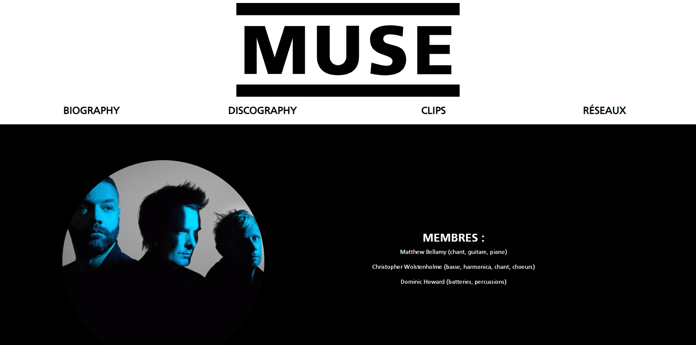
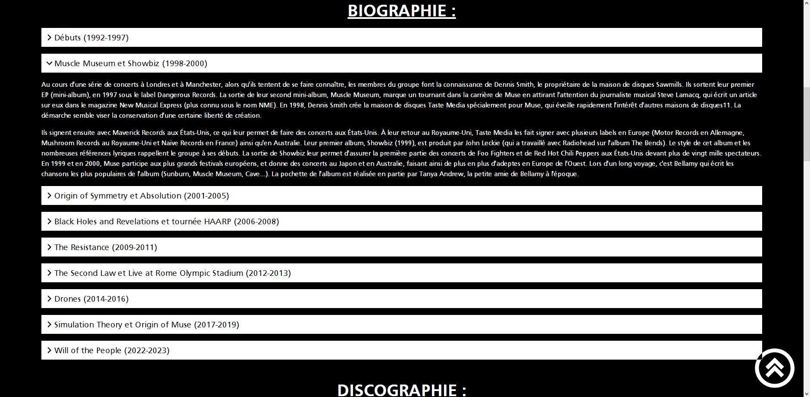
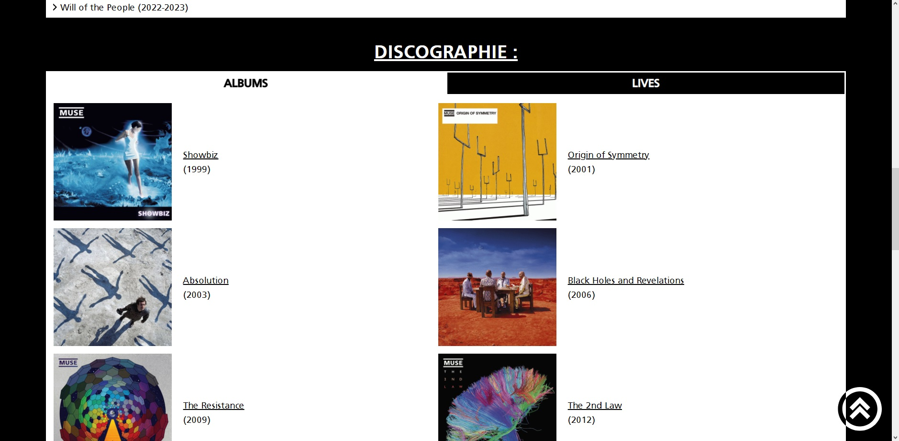
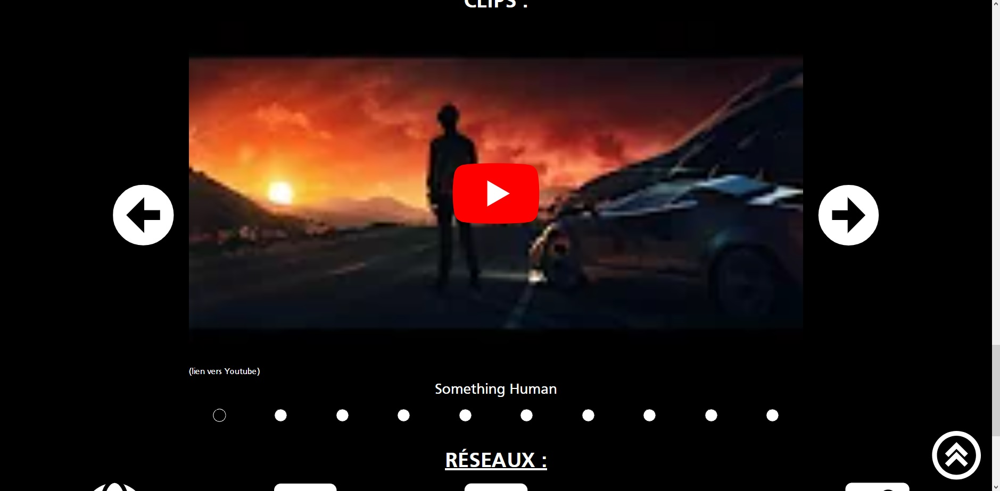

# Muse-Fanpage

A one-page website about the band "Muse". Made using the "Boostrap" CSS framework. This site allowed me to experiment "Bootstrap" and to made an accessible site.
## Features
- The band biography
- The discography of the band
- A carousel with the clips
- The networks links of "Muse"
- Fully accessible
## Installation
1. Download the repository by clicking on `Code > Download ZIP`
2. Extract the ZIP file
3. Move the resulting files at the root of your website
## Usage
Once you have installed the project, you can open it by opening your website url in your browser.

You can scroll to the band biography.

Or to the discography section.

You can also explore some clips of the band with a link to Youtube for all of them.

